<!--
  Profile README for github.com/unexperiencedone
  Styled after https://aakshantkumar.vercel.app (paper · ink · spot pink, manga panels).
  Animated panels live in /assets and are generated by scripts/build_svgs.py.
-->

I came up as a gamer, and somewhere along the way the centre of gravity moved from **playing to building**. Now I'm a third-year **B.Tech CSE (AI)** student at **CSJM University, Kanpur**, **Co-founder & VP Tech at [Kaiketsu Tech](https://www.kaiketsutech.online)**, and founder of the hackathon squad **Void Walkers**.

I work across the whole stack: I fine-tune the model, put an API around it, and ship the product in front of real users. I'm as happy arguing about backend routing as about a hero animation, and I'll pick premium craft over templates every time.

<table>
<tr>
<td width="50%" valign="top">

**Research interests · शोध**

- Affective computing & emotion ambiguity
- Multi-agent and voice-first systems
- Lightweight multimodal fusion
- TinyML and edge inference

</td>
<td width="50%" valign="top">

**Right now · अभी**

- Building **Nova**, a local voice OS for Windows 11
- **Drishtikon**: VLM for satellite imagery (SIH 2026 · ISRO)
- Drafting the **AirGated** paper for arXiv
- Running exoplanet hunts on **TESS** light curves

</td>
</tr>
</table>

> **Off the clock:** chess on Chess.com as `insanelyhuman` · original Hindi & Urdu poetry · macro photography & sketching · anime & light novels

### ◆ Nova · AssisstantOS
A voice assistant that lives on the machine and **gets cheaper the longer you use it**. Every request falls through six tiers, cheapest first. Speech in and out runs 100% locally (faster-whisper). Claude Code is the last resort, and each time it solves something, it leaves behind a recipe so the next request doesn't need it.

   
      
&nbsp;→ <a href="https://github.com/unexperiencedone/assistant-"><b>source</b></a>

<table>
<tr>
<td width="50%" valign="top">

### ◆ VedaVoice · *a.k.a. Parchi*
**🏆 Finalist, Mind Installers Hackathon 4.0**

*"रमेश को 500 उधार दिए"* → `{ name: रमेश, amount: ₹500, type: उधार }`

A voice-to-ledger for shopkeepers who talk in Hinglish, not forms. A **DistilBERT NER** model fine-tuned on code-mixed speech, **Llama-3 on Groq** for intent in under 500 ms, Gemini for context, Supabase RLS, and Twilio WhatsApp reminders.

`DistilBERT NER` `FastAPI` `Docker` `Groq` `Gemini` `Supabase` `Next.js`

[Live](https://vedavoice.vercel.app) · [Source](https://github.com/unexperiencedone/vedavoice) · [HF backend](https://huggingface.co/spaces/unexperiencedone/vedavoice_backend) · [Multi-agent variant](https://github.com/unexperiencedone/GenAi-Voice-Ledger)

</td>
<td width="50%" valign="top">

### ◆ AirGated
**📄 Paper in preparation for arXiv**

Offline, un-spoofable classroom attendance. The teacher's laptop *is* the network: captive-portal DNS, a WebSocket latency gate, ARP MAC resolution, a **non-extractable RSA-2048** device key in IndexedDB, and a **MediaPipe face + blink** liveness check. Six gates, each one blocking a specific cheap trick.

`FastAPI` `Web Crypto` `RSA-2048` `WebSockets` `MediaPipe` `OpenCV` `SQLite`

[Source](https://github.com/unexperiencedone/airgated-)

</td>
</tr>
<tr>
<td width="50%" valign="top">

### ◆ Void / AmbiSense · Edge emotion
**🎯 Entered, OpenCV AI Competition 2026**

It started as a hybrid **DistilBERT + LSTM** emotion classifier (TorchScript on HF Spaces). Now it's an on-device **multimodal ambiguity detector** across text, voice prosody and face. It uses int8 models, a sticky-HMM instant emotion, Dirichlet mood over time, and calibrated late fusion that flags `conflict` instead of forcing a label.

`PyTorch` `int8` `HMM` `Late fusion` `TorchScript` `SHAP / LIME`

[Edge source](https://github.com/unexperiencedone/lightweight-emotion-detection) · [Classifier demo](https://emotion-classification-work-fronten.vercel.app) · [HF Space](https://huggingface.co/spaces/unexperiencedone/emotion-classifier-host)

</td>
<td width="50%" valign="top">

### ◆ CivicPulse
**Build With Bharat 2.0 · team Localhost**

A pothole on NH-19 belongs to NHAI. The same pothole 44 m away belongs to Kanpur Nagar Nigam. No classifier can see that, so CivicPulse routes complaints through a **Jurisdiction Registry** (road ownership, wards, utilities, defect-liability periods), starts an SLA clock, and escalates when it breaches.

`Next.js 14` `Supabase` `Jurisdiction Registry` `LLM + ML fallback` `Vitest`

*Private for now · ask me about it*

</td>
</tr>
<tr>
<td width="50%" valign="top">

### ◆ Exoplanet detection from noisy light curves
**Active · solo research build**

Real **TESS** data and real catalogue labels. The plan: classical astrophysics where it's the right tool (detrending, **Transit Least Squares**, `batman` fits, MCMC with `emcee`), deep learning where it earns its place, and uncertainty quantification throughout.

`lightkurve` `wotan` `TLS` `emcee` `PyTorch` `Streamlit`

*In progress*

</td>
<td width="50%" valign="top">

### ◆ CSJMU Student Assistant
**Multi-tier RAG for my own university**

It scrapes notices, syllabus PDFs and exam schedules (SHA-256 dedup), embeds them on a local CPU pipeline with sentence-transformers, and answers questions over **Supabase pgvector** with Groq. Fixing the similarity-search and embedding bottlenecks was most of the work.

`Scrapy` `sentence-transformers` `pgvector` `Groq` `Next.js`

[Source](https://github.com/unexperiencedone/student_assistant_system)

</td>
</tr>
<tr>
<td width="50%" valign="top">

### ◆ Robo Rumble 3.0
**113 / 292 commits, the most of any contributor**

The official site for a national robotics competition. I led the frontend, backend and UI in Next.js, React 19, TypeScript and Tailwind, with Three.js visuals.

[Live](https://robo-rumble-3-0.vercel.app) · [Source](https://github.com/unexperiencedone/robo-rumble-3.0)

</td>
<td width="50%" valign="top">

### ◆ Rise UP Public School
**In production**

A public site, a parent and student portal, and an admin panel behind one secure API: **81 REST endpoints**, 7 roles with RBAC and row-level scoping, JWT refresh rotation, idempotent Razorpay settlement, and email, SMS and WhatsApp behind one orchestrator.

[Live](https://riseuppublicschool.vercel.app) · [Source](https://github.com/unexperiencedone/riseuppublicschool)

</td>
</tr>
</table>

<b>📚 Complete works · सम्पूर्ण रचनाएँ</b> (hackathon builds, experiments and ML notebooks)

 

| Project | What it is | Stack |
|---|---|---|
| [**VedCode**](https://github.com/unexperiencedone/vedcode-ai4bharat) | AI4Bharat: a coding mentor with memory (active recall, a concept "galaxy", context guard) | Next.js 15 · Drizzle · pgvector · multi-agent |
| [**KisanDrishti AI**](https://github.com/unexperiencedone/KisanDrishti-AI) | STCR fertilizer prescriptions per target yield, weather intelligence, AI explanations | Next.js · AWS Bedrock |
| [**Propely**](https://github.com/unexperiencedone/Propely) | Canteen demand forecasting to cut food waste: MAE 28.38 at a 95% service level | LightGBM · Conformal Prediction |
| [**Indian Railways, two ways**](https://github.com/voidwalkers-csjmu/sih-25022-rail-project) | Crowd-level prediction (95.8% acc) plus a discrete-event sim where a DQN learns train precedence | scikit-learn · DQN |
| [**Snake AI**](https://github.com/unexperiencedone/snake_ai_using_rl) | A Deep Q-Network that learns Snake from nothing but reward | PyTorch · RL |
| **Smart Home Ear** | Environmental-sound classifier on ESC-50 with Mel-spectrograms and spectral-subtraction denoising | PyTorch CNN |
| [**Crowd Management**](https://github.com/unexperiencedone/Crowd-Management-Project) | Indian Railways compartment crowd-level classifier | scikit-learn |
| [**Introvert / Extrovert**](https://github.com/unexperiencedone/introvert-extrovert-classifier-) | Kaggle personality classification: RandomForest, XGBoost, neural nets | Kaggle |
| [**Placement Predictor**](https://github.com/unexperiencedone/placement_predictor) | My first ML model: logistic regression with scaling and cross-validation | scikit-learn |
| [**Pothole Detection**](https://github.com/unexperiencedone/pothole-detection) | Road-damage detection script | OpenCV |
| [**TaskFlow**](https://github.com/unexperiencedone/taskflow-internship-assignment) | Secure task workspace: JWT in httpOnly cookies | Next.js · Prisma |
| [**Hotel Booking**](https://github.com/unexperiencedone/hotel-booking-system) | Reservations with custom auth and migrations | Next.js · Drizzle · PostgreSQL |
| [**Lumière Jewellery**](https://github.com/unexperiencedone/artificial-jewellery-app) | E-commerce with JWT + OAuth and USER/ADMIN roles | Next.js · Prisma |
| [**Robo Rumble 2026**](https://github.com/unexperiencedone/robo-rumble-2026) | Event registration platform with SMTP notifications | Next.js 15 · MongoDB · Three.js |
| [**Apprch**](https://github.com/unexperiencedone/apprch) *(contribution)* | NFC tap-to-log household triggers | SwiftUI · Jetpack Compose · Firebase |
| [**MindBloom**](https://github.com/unexperiencedone/mindbloom-ai) · [**NourishNow**](https://github.com/unexperiencedone/nourish-now) · [**Resume Maker**](https://github.com/unexperiencedone/resume-maker) | Smaller product experiments | React · Next.js |
| [**DSA**](https://github.com/unexperiencedone/DSA) · [**Cybersecurity**](https://github.com/unexperiencedone/Cybersecurity) | Study logs | C / C++ · Python |

<b>🏯 Kaiketsu Tech · समाधान</b> (client work, shipped with real DNS, SSL and payments)

 

| Client | Build |
|---|---|
| [**Astrologer Komal Kalra**](https://komal-kalra.vercel.app) | Full booking platform: custom calendar state machine, payment flow, Supabase |
| [**Suhag Bindi Store**](https://suhag-bindi-store-latest.vercel.app) | D2C e-commerce for an artisanal brand |
| [**Bansal Travels**](https://bansaltravels.online) | Cab booking for tourists touring Manali from Zirakpur |
| [**Devine Digital Academy**](https://devine-digital-academy.vercel.app) | High-conversion course landing page |
| [**Rise UP Public School**](https://riseuppublicschool.vercel.app) | School platform, portals and admin (see above) |
| [**Latent Image Studio**](https://photostudio-sigma.vercel.app) | Editorial photography studio site in vanilla HTML, CSS and JS |
| [**Tech Fest 2026**](https://tech-fest-2026.vercel.app) · [**School sample**](https://school-sample-delta.vercel.app) | Premium sample sites |

<table>
<tr>
<td width="22%"><b>Models</b> मॉडल</td>
<td>
 
           
</td>
</tr>
<tr>
<td><b>LLMs & agents</b> एजेंट</td>
<td>
         
</td>
</tr>
<tr>
<td><b>Data & serving</b> डेटा और सर्विंग</td>
<td>
 
         
</td>
</tr>
<tr>
<td><b>Product</b> प्रोडक्ट</td>
<td>
 
        
</td>
</tr>
<tr>
<td><b>Craft & tools</b> शिल्प</td>
<td>

</td>
</tr>
</table>

| | Feat | Where |
|:-:|---|---|
| 🏆 | **Finalist**, Mind Installers Hackathon 4.0 (VedaVoice / Parchi) | IIMT, Greater Noida |
| 🏆 | **Finalist**, HACKSHODH Hackathon | CSJMU, Kanpur |
| ⚙️ | **113 / 292 commits**, the most of any contributor, on Robo Rumble 3.0 | National robotics competition |
| 🎯 | **Entered**, OpenCV AI Competition 2026 (Best Use of COOL & Agentic Vision) | Void / AmbiSense |
| 🛰️ | **Smart India Hackathon 2026**, team VAYU (ISRO problem statement) | Drishtikon |
| 🏙️ | **Build With Bharat 2.0**, team Localhost | CivicPulse |
| 🎙️ | **Google GenAI APAC Academy Hackathon 2026**, team Void Walkers | VedaVoice AI |
| 💼 | **Data Visualization Analyst Intern**, Excelerate (Aug – Sep 2025) | Looker Studio · pandas · SQL |
| 🐍 | **Python Programming Intern**, CodSoft (Aug – Oct 2025) | Python |
| 🏢 | **Co-founder & VP Tech**, Kaiketsu Tech | Client builds & MVP delivery |

<picture>
  <source media="(prefers-color-scheme: dark)" srcset="https://raw.githubusercontent.com/unexperiencedone/unexperiencedone/output/snake-dark.svg"/>
  <source media="(prefers-color-scheme: light)" srcset="https://raw.githubusercontent.com/unexperiencedone/unexperiencedone/output/snake-light.svg"/>
  
</picture>

**The next arc starts with a message.** Internships, research collaborations, hackathon teams, or a website for your business.
 एक ईमेल काफ़ी है।

  

